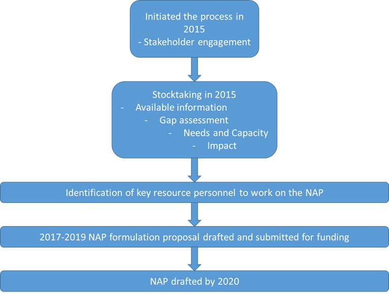

# Approach/Methodologies

##	Guiding principles

The guiding principles are drawn from a number of documents, including: The Constitution of Lesotho, Lesotho Vision 2020, The National Strategic Develop Plan II 2018-2023, the National Communications to UNFCCC, and the principles outlined in the UNFCCC ‘Technical guidelines for the national adaptation plan process’.

```{r, include=FALSE}
knitr::opts_chunk$set(echo = FALSE, message = FALSE, warning=FALSE)
``` 

```{r}
library(flextable)
library(magrittr)
principles<-readxl::read_excel("Tables_from_NAP.xlsx", 
    sheet = "nap_principles")
t1<-flextable(principles,col_keys = names(principles),
  cwidth = 3,
  cheight = 0.01,
  defaults = list(),
   theme_booktabs())
t2<-fontsize(t1,part = 'all', size = 8)
t3<-border_outer(t2,part = 'all', border = NULL)
t4<-border_inner(t3,part = 'all', border = NULL)
t4

```

##	Guidelines used

The main guidelines used included: 

*	The Technical Guidelines for the National Adaptation Plan Process, UNFCCC – this was used as the primary document for framing of the structure and content of the NAP.  It also requires that the NAP process: follows a country-driven, fully transparent, approach; is based on and guided by the best available science and, as appropriate, traditional and indigenous knowledge; and facilitates country-owned, country-driven action and not be prescriptive, nor result in the duplication of efforts undertaken in-country. 
*	National Climate Change Policy 2017-2027
*	Lesotho National Communications to the Conference of Parties of the UNFCCC
*	Lesotho Vision 2020
*	The National Strategic Develop Plan II 2018-2023
*	Lesotho’s Nationally Determined Contribution 2017
*	National Adaptation Plan of Action 2007
*	NAP Stocktaking Report 2015.
*	Lesotho Resilience Strategic Framework  2017
*	Guidelines for integration of climate change into National , Sectoral and Local Policies, Strategies and Development Plans 2018

In addition, and following the experiences gathered from the implementation of the NAPA process, the Technical Guidelines recommend:
*	using locally defined criteria for ranking vulnerabilities and prioritizing project activities, which will build confidence and buy-in across all stakeholders; 
*	using available data and assessments as a basis for more comprehensive assessments; and
*	engaging national experts, as this will also enhance the experience and capacity of the country.
*	Using findings from  past and ongoing projects midterm reviews

These were supported with emerging new data from the published literature. The assessment of these documents together included:

a.	Process of identification/stocktaking of desirable and available information  

i.	Climate and socio-economic data and information
ii.	Current assessments: Exploring possibilities for further assessments
iii.	Policies, strategies, plans
iv.	Existing initiatives on adaptation

b.	Resource mobilization for the process.


##	A systems approach to adaptation

Systems are complex, and each system interacts to various degrees with other related systems.  Sectoral interventions have not been as successful as desired because they do not take into account the interactions of system components, including the fact that the mandate to manage some components of the system may lie in a different sector, and hence come under a different institutional mandate whose primary goal is not necessarily in tandem with those of another sector, and more often than not, there is very little synergy between sectoral programmes. 

Urban areas, for example, are complex since many social, physical and economic systems meet and interact, with many of these extending well beyond its spatial boundaries, e.g. water and power supply systems, while other linkages may be transboundary. It is important, therefore, that National Adaptation Plans capture these systems and their interlinkages, scale and stakeholder diversity, so that appropriate and synergistic adaptation measures can be devised and implemented. Thus, the NAP process uses a systems approach which facilitates the integration of climate change adaptation, in a coherent manner, into relevant new and existing policies, programmes and activities, in particular development planning processes and strategies, within all relevant sectors and at different levels, as appropriate.

The framework to guide the assessment of vulnerabilities and risks included:  

i.	Conceptual framework of vulnerability and risk at various levels: national, system level, local level, etc.
ii.	Boundary conditions for the assessment using the period 1971-2000 for baseline climate
iii.	Focus on key systems/sectors
iv.	Synergy with SDGs, Sendai Framework for DRR, and other relevant regional and national frameworks.


##	Other unique considerations

The emergence of the COVID-19 pandemic in early 2020 disrupted, globally, established societal structures and ways of doing things, and has had devastating impacts on human health, stressed health systems and severely disrupted national economies. A UNDP 2020 study “Assessment of the Socio-Economic Impact of COVID-19 on the Kingdom of Lesotho” highlights the high levels of vulnerabilities of individuals, families, and the whole economy with projected overall negative GDP growth for 2021, and the gaps in health systems and infrastructure. This Open NAP initiative has been developed with some steps of the NAP process being omitted, in particular; it has not been possible to apply and get GCF readiness funding, and extensive consultations with stakeholders have not been undertaken because of personnel unavailability due to lockdowns, and challenges of mounting online surveys and poor internet access as well. It is hoped that the situation will normalise soon and the GCF funding can then be used to continue this process and to produce the next NAP.


##	Road Map

This particular process was initiated in 2015 with a stakeholder engagement workshop (Figure 1). During the same year, stocktaking was undertaken to assess the available information on climate change, its impacts, vulnerability of people and ecosystems, and adaptation to climate change impacts. A gap assessment relating to these aspects was undertaken, along with assessment of the needs and capacity to adapt. Key resource persons were identified to work on the NAP from 2017 through to 2021, the target year for having the draft NAP in place. 




