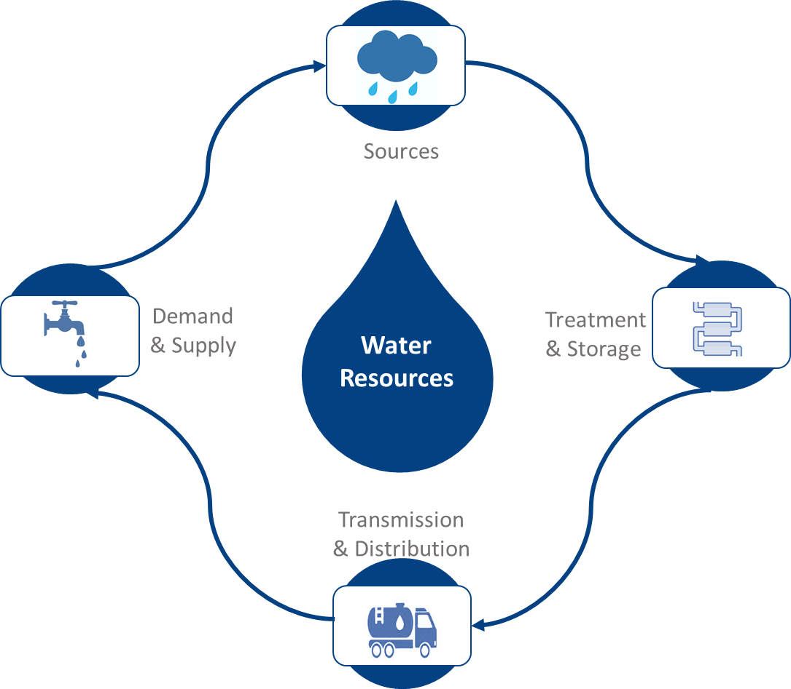

# Climate change adaptation assessment


## Observed climate impacts

The general aspects of the climate and environment of Lesotho have been covered in sections 1 and 4.1 above. In this section, emphasis is on the impacts of observed climate on the identified systems, for which the impacts of climate extreme events are summarised in Table 4 below. The mklongern lowland areas are dry and particularly threatened by drought while mountain and foothill areas are vulnerable to frost, snow, and hail. During the period 1979 to 1996 the country experienced the highest incidences of drought in almost 100 years. The longest drought in the country’s 200-year record of climate monitoring lasted from April 1991 to October 1995 and was related to severe reductions in food production that ranged from 50-75% (Rook, 2005; NDC, 2017). A more recent drought that occurred in 2015/16 drought was the worst experienced in Lesotho in 35 years and resulted in US$82 million (3.6% of GDP in 2016) being mobilized to respond to it. It affected 979,000 people and left around 709,000 people food-insecure, resulted in a 66% reduction in cereal production and 58% increase in food price, and increased the need for external food supply. 

_Temperature Anomaly_

```{r, include=FALSE}
knitr::opts_chunk$set(echo = FALSE, message = FALSE, warning=FALSE)
``` 

```{r}
library(tidyr)
library(dplyr)
library(magrittr)
# mean temp 1901-2019
TEMP <- read.table("C:/Workspace/RMardown_NAPS/Open-NAPs-Data/opennaps/Lesotho/CRU.CY.4.04.TMP_LSO.txt", header=TRUE, quote="\"", stringsAsFactors=TRUE)

mtemp<-TEMP[,c(-1,-14,-15,-16,-17,-18)]
anntemp<-TEMP[,c(1,18)]

# base 1961-1990
base81<-subset(anntemp, YEAR>1960)%>%subset( YEAR<1991)

meanbase<-sum(base81$ANN)/30
  
anntemp$anomaly<-anntemp$ANN-meanbase

anntemp$pos<-anntemp$anomaly >=0

anntemp%>%dplyr::filter(YEAR>1950)%>%
ggplot()+
  geom_col(aes(x = YEAR, y = anomaly, fill = pos),position = "identity", colour = "white", size = 0.01) +
  labs(x='Year', y= 'Temperature Anomaly (°C)')+
  ggtitle('      Lesotho \n(Base: 1961-1990)')+
  scale_fill_manual(values = c('blue', 'red'), guide = 'none')

```

```{r}
library(tidyr)
library(dplyr)
library(magrittr)
# mean temp 1901-2019
TEMP <- read.table("C:/Workspace/RMardown_NAPS/Open-NAPs-Data/opennaps/Lesotho/CRU.CY.4.04.TMP_LSO.txt", header=TRUE, quote="\"", stringsAsFactors=TRUE)

mtemp<-TEMP[,c(-1,-14,-15,-16,-17,-18)]
anntemp<-TEMP[,c(1,18)]

# base 1981-2010
base81<-subset(anntemp, YEAR>1980)%>%subset( YEAR<2011)

meanbase<-sum(base81$ANN)/30
  
anntemp$anomaly<-anntemp$ANN-meanbase

anntemp$pos<-anntemp$anomaly >=0

anntemp%>%dplyr::filter(YEAR>1950)%>%
ggplot()+
  geom_col(aes(x = YEAR, y = anomaly, fill = pos),position = "identity", colour = "white", size = 0.01) + ggtitle('   Lesotho \n(Base: 1981-2010)')+
  labs(x='Year', y= 'Temperature Anomaly (°C)')+
  scale_fill_manual(values = c('blue', 'red'), guide = "none")

```

_Rainfall Anomaly_

```{r}
library(tidyr)
library(dplyr)
library(magrittr)
# mean pr 1901-2019
pr <- read.table("C:/Workspace/RMardown_NAPS/Open-NAPs-Data/opennaps/Lesotho/CRU.CY.4.04.PRE_LSO.txt", header=TRUE, quote="\"", stringsAsFactors=TRUE)

mpr<-pr[,c(-1,-14,-15,-16,-17,-18)]
annpr<-pr[,c(1,18)]

# base 1961-1990
base81<-subset(annpr, YEAR>1960)%>%subset( YEAR<1991)

meanbase<-sum(base81$ANN)/30
  
annpr$anomaly<-annpr$ANN-meanbase

annpr$pos<-annpr$anomaly >=0

annpr%>%dplyr::filter(YEAR>1950)%>%
ggplot()+
  geom_col(aes(x = YEAR, y = anomaly, fill = pos),position = "identity", colour = "white", size = 0.01) +
  labs(x='Year', y= 'Precipitation Anomaly (mm)')+
      ggtitle('    Lesotho \n(Base: 1961-1990)')+
  scale_fill_manual(values = c('red', 'blue'), guide = 'none')

```


```{r}
library(tidyr)
library(dplyr)
library(magrittr)
# mean pr 1901-2019
pr <- read.table("C:/Workspace/RMardown_NAPS/Open-NAPs-Data/opennaps/Lesotho/CRU.CY.4.04.PRE_LSO.txt", header=TRUE, quote="\"", stringsAsFactors=TRUE)

mpr<-pr[,c(-1,-14,-15,-16,-17,-18)]
annpr<-pr[,c(1,18)]

# base 1981-2010
base81<-subset(annpr, YEAR>1980)%>%subset( YEAR<2011)

meanbase<-sum(base81$ANN)/30
  
annpr$anomaly<-annpr$ANN-meanbase

annpr$pos<-annpr$anomaly >=0

annpr%>%dplyr::filter(YEAR>1950)%>%
ggplot()+
  geom_col(aes(x = YEAR, y = anomaly, fill = pos),position = "identity", colour = "white", size = 0.01) + ggtitle('      Lesotho \n(Base: 1981-2010)')+
  labs(x='Year', y= 'Precipitation Anomaly (mm)')+
  scale_fill_manual(values = c('red', 'blue'), guide = "none")

```

Recurrent droughts in 2017/2018,  2018/2019 and 2019/2020 led to three back-to-back failed harvests. In 2019, production of major cereals decreased by more than 60 % compared to 2018, including a 78 % decrease for maize, 61 %  for wheat, and 93 % for sorghum. This followed a poor 2017/2018 season. As a result, more than 500,000 people were left food-insecure in 2019. In response to the humanitarian crisis brought about by the recurrent droughts,  the Government of Lesotho developed a Drought Response and Resilience Plan which  required US$83.2 million. In support of the  Drought Response and Resilience Plan, a Flash Appeal was implemented. Under the Flash Appeal, 261,000 people were targeted with life-saving interventions between November 2019 and April 2020. 


```{r}
library(flextable)
library(magrittr)
hazards<-readxl::read_excel("Tables_from_NAP.xlsx", 
    sheet = "cc_hazards")
t1<-flextable(hazards,col_keys = names(hazards),
  cwidth = 3,
  cheight = 0.01,
  defaults = list(),
   theme_booktabs())
t2<-fontsize(t1,part = 'all', size = 8)
t3<-border_outer(t2,part = 'all', border = NULL)
t4<-border_inner(t3,part = 'all', border = NULL)
t5<-bold(t4,part='header')
t6<-set_caption(t5, "Examples of notable past extreme climate events, impacts and impacted systems in Lesotho.")
t6

```


Yields vary significantly, depending on the amount of rainfall, but are generally low, contributing to widespread poverty in rural areas (World Bank 2018). Maize yields have fallen from 1,400 kg per hectare in the mid-1970s to 450-500 kg per hectare in the past decade (LMS 2000; LMS 2013; Dejene et al., 2011). Though Lesotho maize yield fluctuated substantially in recent years, it tended to decrease through 1971 - 2020 period ending at 0.88 tonnes per ha in 2020 (ref).  On the other hand, river floods, high runoff from hillslopes, and rock slides in 2010/11 that were caused by a series of heavy rains accompanied by strong winds and localized hailstorms affected 500,000 people (28% of the country’s population), displaced 3,360 people, and severely damaged crops, washed away fields, damaged transport infrastructure, affected or destroyed many houses, and increased food insecurity (World Bank 2019). In 2018 floods killed 12 people, 7 children were injured, more than 1 400 people and 315 households were displaced, public infrastructure worth USD 4 million and crops worth USD 1,5 million were damaged. Amidst  the Covid 19 pandemic in January 2021, the country was hit by heavy rains which led to the declaration of a six-months state of emergency (GoL, 2021). The heavy rains caused havoc to water sources, infrastructure, property, washed away crop fields and damaged graveyards. Due to the destroyed road infrastructure including bridges most of Basotho were left stranded and unable to access essential services. The cost of responding to the heavy rains was estimated at USD 2.8 million which is 2.3 percent of the budget (World Bank, 2021).  These impacts are occurring in a country where more than 75% of the population living in rural areas experiences water shortages (Ministry of Energy, Meteorology and Water Affairs 2013) which exacerbates vulnerability to droughts and floods. The changing climate has, therefore, already drastically affected the principal crops of maize, sorghum, and wheat, which are planted on nearly 85 percent of the cultivated area while livestock which contributes 30 percent of total agricultural output are threatened by drought and rangeland degradation (Gwimbi et al. 2012). Lesotho’s crop production is dominated by maize which accounted for 63% of the area planted in 1995/96 (LMS 2000). These changes are occurring against a backdrop of decreasing hectarage of land under cultivation, from 450,000 hectares in 1960, down to between 136,500 and 300,500 hectares in the 1990s and increasing dependency on food imports to satisfy local demand (LMS 2000). 


## Projected future climate


The most recently developed climate change projections by the Lesotho Meteorological Services use a set of scenarios called Representative Concentration Pathways (RCPs). There are four pathways under RCPs namely: RCP8.5, RCP6, RCP4.5 and RCP2.6. The pathways describe different climate futures, all of which are considered possible depending on the volume of greenhouse gases (GHG) emitted in the years to come. RCP2.6, RCP4.5, RCP6, and RCP8.5 are labelled after a possible range of radiative forcing values in the year 2100 (2.6, 4.5, 6, and 8.5 W/m2, respectively).
The projected change in the annual average surface maximum (TX) and minimum temperatures (TN) projected over Lesotho are shown in Figures 3 (a) and (b) respectively. The plotted changes are for the time periods 2011-2040 (near-future), 2041-2070 (mid-future) and 2071-2100 (distant-future) relative to the reference period 1971-2000 (baseline period). The projected changes reflect a gradual increase in the annual average surface maximum temperature (TX) and minimum temperatures (TN) for Lesotho during the 21st century (LMS, 2018). The figures further portray that the gradual increase in temperatures under both RCP4.5 and RCP8.5 is consistent among all grid points. These projections are consistent with other model outputs which indicate temperature rises (Gwimbi et al 2012, Mokoena 2012, LMS 2013 and World Bank 2016). It is projected that temperatures in Lesotho will increase, above the historical average of 12.7°C, by 0.8°C to 2.9°C for the period 2030 to 2050 depending on the scenario (World Bank, 2016). Based on PRECIS driven by an ensemble GCM model data, it was noted that all the models project an increase in temperature of 3.5-4.0° with the highlands getting up to 4.5° for the 2070-2099 horizon (Mokoena 2012).

  


_Figure 3: Summary of multi-model projections of change in a) surface maximum temperature (TX) and b) surface minimum temperature (TN) Source: LMS 2020_


__Mean Temperature change 2021-2040 from climatological mean 1970-2000__

```{r tmean-base, include=FALSE, cache=TRUE}
wc.tmean<-getData("worldclim", var='tmean', res=2.5)
gain(wc.tmean)<-0.1
mwi.tmean<-crop(wc.tmean,ls.sf)%>%raster::mask(ls.sf)
basemn<-sum(mwi.tmean)/12
#plot(basenorth)

#admin1
maseru.tmean<-raster::crop(wc.tmean,maseru)%>%raster::mask(maseru)
basemaseru<-sum(maseru.tmean)/12

quthing.tmean<-raster::crop(wc.tmean,quthing)%>%raster::mask(quthing)
basequthing<-sum(quthing.tmean)/12

mklong.tmean<-raster::crop(wc.tmean,mklong)%>%raster::mask(mklong)
basemklong<-sum(mklong.tmean)/12

bte.tmean<-raster::crop(wc.tmean,bte)%>%raster::mask(bte)
basebte<-sum(bte.tmean)/12
```


                                      National
```{r national}
par(mfrow=c(2,2),mar=c(1, 0, 2.2, 3))

# 126
tn126.40<-raster("C:/Workspace/RMardown_NAPS/Open-NAPs-Data/opennaps/WC_Fut_data/tmin126/wc2.1_2.5m_tmin_BCC-CSM2-MR_ssp126_2021-2040.tif")%>%raster::crop(ls.sf)%>%raster::mask(ls.sf)
tx126.40<-raster("C:/Workspace/RMardown_NAPS/Open-NAPs-Data/opennaps/WC_Fut_data/tmax126/wc2.1_2.5m_tmax_BCC-CSM2-MR_ssp126_2021-2040.tif")%>%raster::crop(ls.sf)%>%raster::mask(ls.sf)
tmn126.40<-(tn126.40+tx126.40)/2
#plot(tmn126.40)
tvar126<-tmn126.40-basemn

plot(tvar126, main='SSP1 - Sustainability', axes=F, box=F, legend=F,col=heat.colors(10, rev = T))
plot(ls1_sf$geometry, add=T)

# 245
tn245.40<-raster("C:/Workspace/RMardown_NAPS/Open-NAPs-Data/opennaps/WC_Fut_data/tmin245/wc2.1_2.5m_tmin_BCC-CSM2-MR_ssp245_2021-2040.tif")%>%raster::crop(ls.sf)%>%raster::mask(ls.sf)
tx245.40<-raster("C:/Workspace/RMardown_NAPS/Open-NAPs-Data/opennaps/WC_Fut_data/tmax245/wc2.1_2.5m_tmax_BCC-CSM2-MR_ssp245_2021-2040.tif")%>%raster::crop(ls.sf)%>%raster::mask(ls.sf)
tmn245.40<-(tn245.40+tx245.40)/2
#plot(tmn245.40)
tvar245<-tmn245.40-basemn

plot(tvar245,main='SSP2 - Middle of the Road', axes=F, box=F, legend=F,col=heat.colors(10, rev = T))
plot(ls1_sf$geometry, add=T)


# 370
tn370.40<-raster("C:/Workspace/RMardown_NAPS/Open-NAPs-Data/opennaps/WC_Fut_data/tmin370/wc2.1_2.5m_tmin_BCC-CSM2-MR_ssp370_2021-2040.tif")%>%raster::crop(ls.sf)%>%raster::mask(ls.sf)
tx370.40<-raster("C:/Workspace/RMardown_NAPS/Open-NAPs-Data/opennaps/WC_Fut_data/tmax370/wc2.1_2.5m_tmax_BCC-CSM2-MR_ssp370_2021-2040.tif")%>%raster::crop(ls.sf)%>%raster::mask(ls.sf)
tmn370.40<-(tn370.40+tx370.40)/2
#plot(tmn370.40)
tvar370<-tmn370.40-basemn

plot(tvar370, main='SSP3 - Regional Rivalry', axes=F, box=F, legend=F,col=heat.colors(10, rev = T))
plot(ls1_sf$geometry, add=T)

#585
tn585.40<-raster("C:/Workspace/RMardown_NAPS/Open-NAPs-Data/opennaps/WC_Fut_data/tmin585/wc2.1_2.5m_tmin_BCC-CSM2-MR_ssp585_2021-2040.tif")%>%raster::crop(ls.sf)%>%raster::mask(ls.sf)
tx585.40<-raster("C:/Workspace/RMardown_NAPS/Open-NAPs-Data/opennaps/WC_Fut_data/tmax585/wc2.1_2.5m_tmax_BCC-CSM2-MR_ssp585_2021-2040.tif")%>%raster::crop(ls.sf)%>%raster::mask(ls.sf)
tmn585.40<-(tn585.40+tx585.40)/2
#plot(tmn585.40)
tvar585<-tmn585.40-basemn

plot(tvar585,main='SSP5 - Fossil-fueled Development', axes=F, box=F,col=heat.colors(10, rev = T),legend.only=FALSE, horizontal = FALSE,legend.args = list(text='°C', side = 3, line = 1))
plot(ls1_sf$geometry, add=T)


```


                                          Maseru

```{r maseru}
par(mfrow=c(2,2),mar=c(1, 0, 2.2, 3))

# 126
tn126.40<-raster("C:/Workspace/RMardown_NAPS/Open-NAPs-Data/opennaps/WC_Fut_data/tmin126/wc2.1_2.5m_tmin_BCC-CSM2-MR_ssp126_2021-2040.tif")%>%raster::crop(maseru)%>%raster::mask(maseru)
tx126.40<-raster("C:/Workspace/RMardown_NAPS/Open-NAPs-Data/opennaps/WC_Fut_data/tmax126/wc2.1_2.5m_tmax_BCC-CSM2-MR_ssp126_2021-2040.tif")%>%raster::crop(maseru)%>%raster::mask(maseru)
tmn126.40<-(tn126.40+tx126.40)/2
#plot(tmn126.40)
tvar126<-tmn126.40-basemaseru

plot(tvar126, main='SSP1 - Sustainability', axes=F, box=F, legend=F,col=heat.colors(10, rev = T))
plot(ls1_sf$geometry, add=T, lwd=0.001)
plot(maseru2$geometry, add=T)


# 245
tn245.40<-raster("C:/Workspace/RMardown_NAPS/Open-NAPs-Data/opennaps/WC_Fut_data/tmin245/wc2.1_2.5m_tmin_BCC-CSM2-MR_ssp245_2021-2040.tif")%>%raster::crop(maseru)%>%raster::mask(maseru)
tx245.40<-raster("C:/Workspace/RMardown_NAPS/Open-NAPs-Data/opennaps/WC_Fut_data/tmax245/wc2.1_2.5m_tmax_BCC-CSM2-MR_ssp245_2021-2040.tif")%>%raster::crop(maseru)%>%raster::mask(maseru)
tmn245.40<-(tn245.40+tx245.40)/2
#plot(tmn245.40)
tvar245<-tmn245.40-basemaseru

plot(tvar245,main='SSP2 - Middle of the Road', axes=F, box=F, legend=F,col=heat.colors(10, rev = T))
plot(ls1_sf$geometry, add=T, lwd=0.001)
plot(maseru2$geometry, add=T)


# 370
tn370.40<-raster("C:/Workspace/RMardown_NAPS/Open-NAPs-Data/opennaps/WC_Fut_data/tmin370/wc2.1_2.5m_tmin_BCC-CSM2-MR_ssp370_2021-2040.tif")%>%raster::crop(maseru)%>%raster::mask(maseru)
tx370.40<-raster("C:/Workspace/RMardown_NAPS/Open-NAPs-Data/opennaps/WC_Fut_data/tmax370/wc2.1_2.5m_tmax_BCC-CSM2-MR_ssp370_2021-2040.tif")%>%raster::crop(maseru)%>%raster::mask(maseru)
tmn370.40<-(tn370.40+tx370.40)/2
#plot(tmn370.40)
tvar370<-tmn370.40-basemaseru

plot(tvar370, main='SSP3 - Regional Rivalry', axes=F, box=F, legend=F,col=heat.colors(10, rev = T))
plot(ls1_sf$geometry, add=T, lwd=0.001)
plot(maseru2$geometry, add=T)

#585
tn585.40<-raster("C:/Workspace/RMardown_NAPS/Open-NAPs-Data/opennaps/WC_Fut_data/tmin585/wc2.1_2.5m_tmin_BCC-CSM2-MR_ssp585_2021-2040.tif")%>%raster::crop(maseru)%>%raster::mask(maseru)
tx585.40<-raster("C:/Workspace/RMardown_NAPS/Open-NAPs-Data/opennaps/WC_Fut_data/tmax585/wc2.1_2.5m_tmax_BCC-CSM2-MR_ssp585_2021-2040.tif")%>%raster::crop(maseru)%>%raster::mask(maseru)
tmn585.40<-(tn585.40+tx585.40)/2
#plot(tmn585.40)
tvar585<-tmn585.40-basemaseru

plot(tvar585,main='SSP5 - Fossil-fueled Development', axes=F, box=F,col=heat.colors(10, rev = T),legend.only=FALSE, horizontal = FALSE,legend.args = list(text='°C', side = 3, line = 1))
plot(ls1_sf$geometry, add=T, lwd=0.001)
plot(maseru2$geometry, add=T)


```


                                          Mokhotlong

```{r mklong}
par(mfrow=c(2,2),mar=c(1, 0, 2.2, 3))

# 126
tn126.40<-raster("C:/Workspace/RMardown_NAPS/Open-NAPs-Data/opennaps/WC_Fut_data/tmin126/wc2.1_2.5m_tmin_BCC-CSM2-MR_ssp126_2021-2040.tif")%>%raster::crop(mklong)%>%raster::mask(mklong)
tx126.40<-raster("C:/Workspace/RMardown_NAPS/Open-NAPs-Data/opennaps/WC_Fut_data/tmax126/wc2.1_2.5m_tmax_BCC-CSM2-MR_ssp126_2021-2040.tif")%>%raster::crop(mklong)%>%raster::mask(mklong)
tmn126.40<-(tn126.40+tx126.40)/2
#plot(tmn126.40)
tvar126<-tmn126.40-basemklong

plot(tvar126, main='SSP1 - Sustainability', axes=F, box=F, legend=F,col=heat.colors(10, rev = T))
plot(ls1_sf$geometry, add=T, lwd=0.001)
plot(mklong2$geometry, add=T)


# 245
tn245.40<-raster("C:/Workspace/RMardown_NAPS/Open-NAPs-Data/opennaps/WC_Fut_data/tmin245/wc2.1_2.5m_tmin_BCC-CSM2-MR_ssp245_2021-2040.tif")%>%raster::crop(mklong)%>%raster::mask(mklong)
tx245.40<-raster("C:/Workspace/RMardown_NAPS/Open-NAPs-Data/opennaps/WC_Fut_data/tmax245/wc2.1_2.5m_tmax_BCC-CSM2-MR_ssp245_2021-2040.tif")%>%raster::crop(mklong)%>%raster::mask(mklong)
tmn245.40<-(tn245.40+tx245.40)/2
#plot(tmn245.40)
tvar245<-tmn245.40-basemklong

plot(tvar245,main='SSP2 - Middle of the Road', axes=F, box=F, legend=F,col=heat.colors(10, rev = T))
plot(ls1_sf$geometry, add=T, lwd=0.001)
plot(mklong2$geometry, add=T)


# 370
tn370.40<-raster("C:/Workspace/RMardown_NAPS/Open-NAPs-Data/opennaps/WC_Fut_data/tmin370/wc2.1_2.5m_tmin_BCC-CSM2-MR_ssp370_2021-2040.tif")%>%raster::crop(mklong)%>%raster::mask(mklong)
tx370.40<-raster("C:/Workspace/RMardown_NAPS/Open-NAPs-Data/opennaps/WC_Fut_data/tmax370/wc2.1_2.5m_tmax_BCC-CSM2-MR_ssp370_2021-2040.tif")%>%raster::crop(mklong)%>%raster::mask(mklong)
tmn370.40<-(tn370.40+tx370.40)/2
#plot(tmn370.40)
tvar370<-tmn370.40-basemklong

plot(tvar370, main='SSP3 - Regional Rivalry', axes=F, box=F, legend=F,col=heat.colors(10, rev = T))
plot(ls1_sf$geometry, add=T, lwd=0.001)
plot(mklong2$geometry, add=T)


#585
tn585.40<-raster("C:/Workspace/RMardown_NAPS/Open-NAPs-Data/opennaps/WC_Fut_data/tmin585/wc2.1_2.5m_tmin_BCC-CSM2-MR_ssp585_2021-2040.tif")%>%raster::crop(mklong)%>%raster::mask(mklong)
tx585.40<-raster("C:/Workspace/RMardown_NAPS/Open-NAPs-Data/opennaps/WC_Fut_data/tmax585/wc2.1_2.5m_tmax_BCC-CSM2-MR_ssp585_2021-2040.tif")%>%raster::crop(mklong)%>%raster::mask(mklong)
tmn585.40<-(tn585.40+tx585.40)/2
#plot(tmn585.40)
tvar585<-tmn585.40-basemklong

plot(tvar585,main='SSP5 - Fossil-fueled Development', axes=F, box=F,col=heat.colors(10, rev = T),legend.only=FALSE, horizontal = FALSE,legend.args = list(text='°C', side = 3, line = 1))
plot(ls1_sf$geometry, add=T, lwd=0.001)
plot(mklong2$geometry, add=T)


```


                                        Quthing

```{r quthing}
par(mfrow=c(2,2),mar=c(1, 0, 2.2, 3))

# 126
tn126.40<-raster("C:/Workspace/RMardown_NAPS/Open-NAPs-Data/opennaps/WC_Fut_data/tmin126/wc2.1_2.5m_tmin_BCC-CSM2-MR_ssp126_2021-2040.tif")%>%raster::crop(quthing)%>%raster::mask(quthing)
tx126.40<-raster("C:/Workspace/RMardown_NAPS/Open-NAPs-Data/opennaps/WC_Fut_data/tmax126/wc2.1_2.5m_tmax_BCC-CSM2-MR_ssp126_2021-2040.tif")%>%raster::crop(quthing)%>%raster::mask(quthing)
tmn126.40<-(tn126.40+tx126.40)/2
#plot(tmn126.40)
tvar126<-tmn126.40-basequthing

plot(tvar126, main='SSP1 - Sustainability', axes=F, box=F, legend=F,col=heat.colors(10, rev = T))
plot(ls1_sf$geometry, add=T, lwd=0.001)
plot(quthing2$geometry, add=T)


# 245
tn245.40<-raster("C:/Workspace/RMardown_NAPS/Open-NAPs-Data/opennaps/WC_Fut_data/tmin245/wc2.1_2.5m_tmin_BCC-CSM2-MR_ssp245_2021-2040.tif")%>%raster::crop(quthing)%>%raster::mask(quthing)
tx245.40<-raster("C:/Workspace/RMardown_NAPS/Open-NAPs-Data/opennaps/WC_Fut_data/tmax245/wc2.1_2.5m_tmax_BCC-CSM2-MR_ssp245_2021-2040.tif")%>%raster::crop(quthing)%>%raster::mask(quthing)
tmn245.40<-(tn245.40+tx245.40)/2
#plot(tmn245.40)
tvar245<-tmn245.40-basequthing

plot(tvar245,main='SSP2 - Middle of the Road', axes=F, box=F, legend=F,col=heat.colors(10, rev = T))
plot(ls1_sf$geometry, add=T, lwd=0.001)
plot(quthing2$geometry, add=T)


# 370
tn370.40<-raster("C:/Workspace/RMardown_NAPS/Open-NAPs-Data/opennaps/WC_Fut_data/tmin370/wc2.1_2.5m_tmin_BCC-CSM2-MR_ssp370_2021-2040.tif")%>%raster::crop(quthing)%>%raster::mask(quthing)
tx370.40<-raster("C:/Workspace/RMardown_NAPS/Open-NAPs-Data/opennaps/WC_Fut_data/tmax370/wc2.1_2.5m_tmax_BCC-CSM2-MR_ssp370_2021-2040.tif")%>%raster::crop(quthing)%>%raster::mask(quthing)
tmn370.40<-(tn370.40+tx370.40)/2
#plot(tmn370.40)
tvar370<-tmn370.40-basequthing

plot(tvar370, main='SSP3 - Regional Rivalry', axes=F, box=F, legend=F,col=heat.colors(10, rev = T))
plot(ls1_sf$geometry, add=T, lwd=0.001)
plot(quthing2$geometry, add=T)


#585
tn585.40<-raster("C:/Workspace/RMardown_NAPS/Open-NAPs-Data/opennaps/WC_Fut_data/tmin585/wc2.1_2.5m_tmin_BCC-CSM2-MR_ssp585_2021-2040.tif")%>%raster::crop(quthing)%>%raster::mask(quthing)
tx585.40<-raster("C:/Workspace/RMardown_NAPS/Open-NAPs-Data/opennaps/WC_Fut_data/tmax585/wc2.1_2.5m_tmax_BCC-CSM2-MR_ssp585_2021-2040.tif")%>%raster::crop(quthing)%>%raster::mask(quthing)
tmn585.40<-(tn585.40+tx585.40)/2
#plot(tmn585.40)
tvar585<-tmn585.40-basequthing

plot(tvar585,main='SSP5 - Fossil-fueled Development', axes=F, box=F,col=heat.colors(10, rev = T),legend.only=FALSE, horizontal = FALSE,legend.args = list(text='°C', side = 3, line = 1))
plot(ls1_sf$geometry, add=T, lwd=0.001)
plot(quthing2$geometry, add=T)


```


                                        Butha-Buthe

```{r bte}
par(mfrow=c(2,2),mar=c(1, 0, 2.2, 3))

# 126
tn126.40<-raster("C:/Workspace/RMardown_NAPS/Open-NAPs-Data/opennaps/WC_Fut_data/tmin126/wc2.1_2.5m_tmin_BCC-CSM2-MR_ssp126_2021-2040.tif")%>%raster::crop(bte)%>%raster::mask(bte)
tx126.40<-raster("C:/Workspace/RMardown_NAPS/Open-NAPs-Data/opennaps/WC_Fut_data/tmax126/wc2.1_2.5m_tmax_BCC-CSM2-MR_ssp126_2021-2040.tif")%>%raster::crop(bte)%>%raster::mask(bte)
tmn126.40<-(tn126.40+tx126.40)/2
#plot(tmn126.40)
tvar126<-tmn126.40-basebte

plot(tvar126, main='SSP1 - Sustainability', axes=F, box=F, legend=F,col=heat.colors(10, rev = T))
plot(ls1_sf$geometry, add=T, lwd=0.001)
plot(bte2$geometry, add=T)


# 245
tn245.40<-raster("C:/Workspace/RMardown_NAPS/Open-NAPs-Data/opennaps/WC_Fut_data/tmin245/wc2.1_2.5m_tmin_BCC-CSM2-MR_ssp245_2021-2040.tif")%>%raster::crop(bte)%>%raster::mask(bte)
tx245.40<-raster("C:/Workspace/RMardown_NAPS/Open-NAPs-Data/opennaps/WC_Fut_data/tmax245/wc2.1_2.5m_tmax_BCC-CSM2-MR_ssp245_2021-2040.tif")%>%raster::crop(bte)%>%raster::mask(bte)
tmn245.40<-(tn245.40+tx245.40)/2
#plot(tmn245.40)
tvar245<-tmn245.40-basebte

plot(tvar245,main='SSP2 - Middle of the Road', axes=F, box=F, legend=F,col=heat.colors(10, rev = T))
plot(ls1_sf$geometry, add=T, lwd=0.001)
plot(bte2$geometry, add=T)


# 370
tn370.40<-raster("C:/Workspace/RMardown_NAPS/Open-NAPs-Data/opennaps/WC_Fut_data/tmin370/wc2.1_2.5m_tmin_BCC-CSM2-MR_ssp370_2021-2040.tif")%>%raster::crop(bte)%>%raster::mask(bte)
tx370.40<-raster("C:/Workspace/RMardown_NAPS/Open-NAPs-Data/opennaps/WC_Fut_data/tmax370/wc2.1_2.5m_tmax_BCC-CSM2-MR_ssp370_2021-2040.tif")%>%raster::crop(bte)%>%raster::mask(bte)
tmn370.40<-(tn370.40+tx370.40)/2
#plot(tmn370.40)
tvar370<-tmn370.40-basebte

plot(tvar370, main='SSP3 - Regional Rivalry', axes=F, box=F, legend=F,col=heat.colors(10, rev = T))
plot(ls1_sf$geometry, add=T, lwd=0.001)
plot(bte2$geometry, add=T)


#585
tn585.40<-raster("C:/Workspace/RMardown_NAPS/Open-NAPs-Data/opennaps/WC_Fut_data/tmin585/wc2.1_2.5m_tmin_BCC-CSM2-MR_ssp585_2021-2040.tif")%>%raster::crop(bte)%>%raster::mask(bte)
tx585.40<-raster("C:/Workspace/RMardown_NAPS/Open-NAPs-Data/opennaps/WC_Fut_data/tmax585/wc2.1_2.5m_tmax_BCC-CSM2-MR_ssp585_2021-2040.tif")%>%raster::crop(bte)%>%raster::mask(bte)
tmn585.40<-(tn585.40+tx585.40)/2
#plot(tmn585.40)
tvar585<-tmn585.40-basebte

plot(tvar585,main='SSP5 - Fossil-fueled Development', axes=F, box=F,col=heat.colors(10, rev = T),legend.only=FALSE, horizontal = FALSE,legend.args = list(text='°C', side = 3, line = 1))
plot(ls1_sf$geometry, add=T, lwd=0.001)
plot(bte2$geometry, add=T)


```


Unlike for temperature, where models show a general degree of agreement about future regional changes, different models may have the same region becoming wetter or much drier in a warming world. Disagreements between the models in future precipitation changes in some regions does not mean that the models are useless for this purpose. LMS’s predictions show annual precipitation (prcptot) decrease over the North-Eastern Mountains which becomes more intense and spatially pronounced towards the end of the 21st century under both RCP45 and RCP85 scenarios (figure 4). This agrees with other models such as the CSIRO and MIROC models (Gwimbi et al. 2012) which show that rainfall will decline by 2050, with significant decline in the lowlands, foothills, and mklongern Senqu Valley (CSIRO model) or the whole country (MIROC model). It is projected that the highlands will experience a decrease in the frequency of severe snowfalls and the number of frost days (Morris, 2017). The declining rainfall trend will continue through to the 2070-2099 period (PRECIS ensemble) with 30-40% decrease in winter rainfall, but no significant change for summer rainfall relative to the reference period (1961-1990) (Mokoena 2012). However, Kalognomou et al. (2013) used the CORDEX models to simulate rainfall and noted that higher rainfall results occurred over the Lesotho Highlands and Drakensburg areas. The density of station data in Lesotho is low and this affected the performance of the variable-resolution atmospheric model CCAM which drastically overestimated rainfall totals, far in excess of CRU and TRMM observations, as well as area-averaged intra-annual rainfall cycles simulated for the country (Dedekind et al. 2015). Apart from the wet bias over Lesotho the simulations have a high spatial correlation to the observations (higher than for the annual rainfall totals). The largest overestimations occur over Lesotho and are attributed to its steep and complex topography (Kalognomou et al. 2013; Dedekind et al. 2015); however, the CCAM-NCEP simulations have skill in representing inter-annual variability of summer rainfall over the Lesotho region and can therefore be used to project future climate (Dedekind et al. 2015). 


__Precipitation change 2021-2040 based on climatological mean 1971-2000__

```{r pr-base, include=FALSE,cache=TRUE}
wc.prec<-getData("worldclim", var='prec', res=2.5)
ls.prec<-crop(wc.prec,ls.sf)%>%raster::mask(ls.sf)
pr.basemn<-sum(ls.prec)/12
#plot(basemn)

#admin1
maseru.prec<-raster::crop(wc.prec,maseru)%>%raster::mask(maseru)
pr.basemaseru<-sum(maseru.prec)/12

quthing.prec<-raster::crop(wc.prec,quthing)%>%raster::mask(quthing)
pr.basequthing<-sum(quthing.prec)/12

mklong.prec<-raster::crop(wc.prec,mklong)%>%raster::mask(mklong)
pr.basemklong<-sum(mklong.prec)/12

bte.prec<-raster::crop(wc.prec,bte)%>%raster::mask(bte)
pr.basebte<-sum(bte.prec)/12
```

                                National
```{r pr-national}
par(mfrow=c(2,2),mar=c(1, 0, 2, 2))

# 126
pr126.40<-raster("C:/Workspace/RMardown_NAPS/Open-NAPs-Data/opennaps/WC_Fut_data/pr126/wc2.1_2.5m_prec_BCC-CSM2-MR_ssp126_2021-2040.tif")%>%raster::crop(ls.sf)%>%raster::mask(ls.sf)
#plot(pr126.40)
prvar126<-pr126.40-pr.basemn

plot(prvar126, axes=F, box=F, main='SSP1 - Sustainability', legend=F)
plot(ls1_sf$geometry, add=T)

# 245
pr245.40<-raster("C:/Workspace/RMardown_NAPS/Open-NAPs-Data/opennaps/WC_Fut_data/pr245/wc2.1_2.5m_prec_BCC-CSM2-MR_ssp245_2021-2040.tif")%>%raster::crop(ls.sf)%>%raster::mask(ls.sf)
#plot(pr245.40)
prvar245<-pr245.40-pr.basemn

plot(prvar245, axes=F, box=F, main='SSP2 - Middle of the Road', legend=F)
plot(ls1_sf$geometry, add=T)

# 370
pr370.40<-raster("C:/Workspace/RMardown_NAPS/Open-NAPs-Data/opennaps/WC_Fut_data/pr370/wc2.1_2.5m_prec_BCC-CSM2-MR_ssp370_2021-2040.tif")%>%raster::crop(ls.sf)%>%raster::mask(ls.sf)
#plot(pr370.40)
prvar370<-pr370.40-pr.basemn

plot(prvar370, axes=F, box=F, main='SSP3 - Regional Rivalry',legend=F)
plot(ls1_sf$geometry, add=T)

# 585
pr585.40<-raster("C:/Workspace/RMardown_NAPS/Open-NAPs-Data/opennaps/WC_Fut_data/pr585/wc2.1_2.5m_prec_BCC-CSM2-MR_ssp585_2021-2040.tif")%>%raster::crop(ls.sf)%>%raster::mask(ls.sf)
#plot(pr585.40)
prvar585<-pr585.40-pr.basemn

plot(prvar585, axes=F, box=F,legend.only=FALSE, horizontal = FALSE,legend.args = list(text='mm', side = 3, line = 1), main='SSP5 - Fossil-fueled Development')
plot(ls1_sf$geometry, add=T)

```


                                        Maseru

```{r pr-maseru}
par(mfrow=c(2,2),mar=c(1, 0, 2, 2))

# 126
pr126.40<-raster("C:/Workspace/RMardown_NAPS/Open-NAPs-Data/opennaps/WC_Fut_data/pr126/wc2.1_2.5m_prec_BCC-CSM2-MR_ssp126_2021-2040.tif")%>%raster::crop(maseru)%>%raster::mask(maseru)
#plot(pr126.40)
prvar126<-pr126.40-pr.basemaseru

plot(prvar126, axes=F, box=F, main='SSP1 - Sustainability', legend=F)
plot(ls1_sf$geometry, add=T, lwd=0.001)
plot(maseru2$geometry, add=T)


# 245
pr245.40<-raster("C:/Workspace/RMardown_NAPS/Open-NAPs-Data/opennaps/WC_Fut_data/pr245/wc2.1_2.5m_prec_BCC-CSM2-MR_ssp245_2021-2040.tif")%>%raster::crop(maseru)%>%raster::mask(maseru)
#plot(pr245.40)
prvar245<-pr245.40-pr.basemaseru

plot(prvar245, axes=F, box=F, main='SSP2 - Middle of the Road', legend=F)
plot(ls1_sf$geometry, add=T, lwd=0.001)
plot(maseru2$geometry, add=T)


# 370
pr370.40<-raster("C:/Workspace/RMardown_NAPS/Open-NAPs-Data/opennaps/WC_Fut_data/pr370/wc2.1_2.5m_prec_BCC-CSM2-MR_ssp370_2021-2040.tif")%>%raster::crop(maseru)%>%raster::mask(maseru)
#plot(pr370.40)
prvar370<-pr370.40-pr.basemaseru

plot(prvar370, axes=F, box=F, main='SSP3 - Regional Rivalry',legend=F)
plot(ls1_sf$geometry, add=T, lwd=0.001)
plot(maseru2$geometry, add=T)


# 585
pr585.40<-raster("C:/Workspace/RMardown_NAPS/Open-NAPs-Data/opennaps/WC_Fut_data/pr585/wc2.1_2.5m_prec_BCC-CSM2-MR_ssp585_2021-2040.tif")%>%raster::crop(maseru)%>%raster::mask(maseru)
#plot(pr585.40)
prvar585<-pr585.40-pr.basemaseru

plot(prvar585, axes=F, box=F,legend.only=FALSE, horizontal = FALSE,legend.args = list(text='mm', side = 3, line = 1), main='SSP5 - Fossil-fueled Development')
plot(ls1_sf$geometry, add=T, lwd=0.001)
plot(maseru2$geometry, add=T)


```

                                     Quthing

```{r pr-quthing}
par(mfrow=c(2,2),mar=c(1, 0, 2, 2))

# 126
pr126.40<-raster("C:/Workspace/RMardown_NAPS/Open-NAPs-Data/opennaps/WC_Fut_data/pr126/wc2.1_2.5m_prec_BCC-CSM2-MR_ssp126_2021-2040.tif")%>%raster::crop(quthing)%>%raster::mask(quthing)
#plot(pr126.40)
prvar126<-pr126.40-pr.basequthing

plot(prvar126, axes=F, box=F, main='SSP1 - Sustainability', legend=F)
plot(ls1_sf$geometry, add=T, lwd=0.001)
plot(quthing2$geometry, add=T)


# 245
pr245.40<-raster("C:/Workspace/RMardown_NAPS/Open-NAPs-Data/opennaps/WC_Fut_data/pr245/wc2.1_2.5m_prec_BCC-CSM2-MR_ssp245_2021-2040.tif")%>%raster::crop(quthing)%>%raster::mask(quthing)
#plot(pr245.40)
prvar245<-pr245.40-pr.basequthing

plot(prvar245, axes=F, box=F, main='SSP2 - Middle of the Road', legend=F)
plot(ls1_sf$geometry, add=T, lwd=0.001)
plot(quthing2$geometry, add=T)


# 370
pr370.40<-raster("C:/Workspace/RMardown_NAPS/Open-NAPs-Data/opennaps/WC_Fut_data/pr370/wc2.1_2.5m_prec_BCC-CSM2-MR_ssp370_2021-2040.tif")%>%raster::crop(quthing)%>%raster::mask(quthing)
#plot(pr370.40)
prvar370<-pr370.40-pr.basequthing

plot(prvar370, axes=F, box=F, main='SSP3 - Regional Rivalry', legend=F)
plot(ls1_sf$geometry, add=T, lwd=0.001)
plot(quthing2$geometry, add=T)


# 585
pr585.40<-raster("C:/Workspace/RMardown_NAPS/Open-NAPs-Data/opennaps/WC_Fut_data/pr585/wc2.1_2.5m_prec_BCC-CSM2-MR_ssp585_2021-2040.tif")%>%raster::crop(quthing)%>%raster::mask(quthing)
#plot(pr585.40)
prvar585<-pr585.40-pr.basequthing

plot(prvar585, axes=F, box=F,legend.only=FALSE, horizontal = FALSE,legend.args = list(text='mm', side = 3, line = 1), main='SSP5 - Fossil-fueled Development')
plot(ls1_sf$geometry, add=T, lwd=0.001)
plot(quthing2$geometry, add=T)


```


                                      Mokhotlong

```{r, pr-mklong}
par(mfrow=c(2,2),mar=c(1, 0, 2, 2))

# 126
pr126.40<-raster("C:/Workspace/RMardown_NAPS/Open-NAPs-Data/opennaps/WC_Fut_data/pr126/wc2.1_2.5m_prec_BCC-CSM2-MR_ssp126_2021-2040.tif")%>%raster::crop(mklong)%>%raster::mask(mklong)
#plot(pr126.40)
prvar126<-pr126.40-pr.basemklong

plot(prvar126, axes=F, box=F, main='SSP1 - Sustainability', legend=F)
plot(ls1_sf$geometry, add=T, lwd=0.001)
plot(mklong2$geometry, add=T)

# 245
pr245.40<-raster("C:/Workspace/RMardown_NAPS/Open-NAPs-Data/opennaps/WC_Fut_data/pr245/wc2.1_2.5m_prec_BCC-CSM2-MR_ssp245_2021-2040.tif")%>%raster::crop(mklong)%>%raster::mask(mklong)
#plot(pr245.40)
prvar245<-pr245.40-pr.basemklong

plot(prvar245, axes=F, box=F, main='SSP2 - Middle of the Road', legend=F)
plot(ls1_sf$geometry, add=T, lwd=0.001)
plot(mklong2$geometry, add=T)


# 370
pr370.40<-raster("C:/Workspace/RMardown_NAPS/Open-NAPs-Data/opennaps/WC_Fut_data/pr370/wc2.1_2.5m_prec_BCC-CSM2-MR_ssp370_2021-2040.tif")%>%raster::crop(mklong)%>%raster::mask(mklong)
#plot(pr370.40)
prvar370<-pr370.40-pr.basemklong

plot(prvar370, axes=F, box=F, main='SSP3 - Regional Rivalry',legend=F)
plot(ls1_sf$geometry, add=T, lwd=0.001)
plot(mklong2$geometry, add=T)


# 585
pr585.40<-raster("C:/Workspace/RMardown_NAPS/Open-NAPs-Data/opennaps/WC_Fut_data/pr585/wc2.1_2.5m_prec_BCC-CSM2-MR_ssp585_2021-2040.tif")%>%raster::crop(mklong)%>%raster::mask(mklong)
#plot(pr585.40)
prvar585<-pr585.40-pr.basemklong

plot(prvar585, axes=F, box=F, legend.only=FALSE, horizontal = FALSE,legend.args = list(text='mm', side = 3, line = 1), main='SSP5 - Fossil-fueled Development')
plot(ls1_sf$geometry, add=T, lwd=0.001)
plot(mklong2$geometry, add=T)

```

                                     Butha-Buthe

```{r pr-bte}
par(mfrow=c(2,2),mar=c(1, 0, 2, 2))

# 126
pr126.40<-raster("C:/Workspace/RMardown_NAPS/Open-NAPs-Data/opennaps/WC_Fut_data/pr126/wc2.1_2.5m_prec_BCC-CSM2-MR_ssp126_2021-2040.tif")%>%raster::crop(bte)%>%raster::mask(bte)
#plot(pr126.40)
prvar126<-pr126.40-pr.basebte

plot(prvar126, axes=F, box=F, main='SSP1 - Sustainability', legend=F)
plot(ls1_sf$geometry, add=T, lwd=0.001)
plot(bte2$geometry, add=T)


# 245
pr245.40<-raster("C:/Workspace/RMardown_NAPS/Open-NAPs-Data/opennaps/WC_Fut_data/pr245/wc2.1_2.5m_prec_BCC-CSM2-MR_ssp245_2021-2040.tif")%>%raster::crop(bte)%>%raster::mask(bte)
#plot(pr245.40)
prvar245<-pr245.40-pr.basebte

plot(prvar245, axes=F, box=F, main='SSP2 - Middle of the Road', legend=F)
plot(ls1_sf$geometry, add=T, lwd=0.001)
plot(bte2$geometry, add=T)


# 370
pr370.40<-raster("C:/Workspace/RMardown_NAPS/Open-NAPs-Data/opennaps/WC_Fut_data/pr370/wc2.1_2.5m_prec_BCC-CSM2-MR_ssp370_2021-2040.tif")%>%raster::crop(bte)%>%raster::mask(bte)
#plot(pr370.40)
prvar370<-pr370.40-pr.basebte

plot(prvar370, axes=F, box=F, main='SSP3 - Regional Rivalry',legend=F)
plot(ls1_sf$geometry, add=T, lwd=0.001)
plot(bte2$geometry, add=T)


# 585
pr585.40<-raster("C:/Workspace/RMardown_NAPS/Open-NAPs-Data/opennaps/WC_Fut_data/pr585/wc2.1_2.5m_prec_BCC-CSM2-MR_ssp585_2021-2040.tif")%>%raster::crop(bte)%>%raster::mask(bte)
#plot(pr585.40)
prvar585<-pr585.40-pr.basebte

plot(prvar585, axes=F, box=F, legend.only=FALSE, horizontal = FALSE,legend.args = list(text='mm', side = 3, line = 1), main='SSP5 - Fossil-fueled Development')
plot(ls1_sf$geometry, add=T, lwd=0.001)
plot(bte2$geometry, add=T)


```


_Source: [Reliefweb](https://reliefweb.int/report/lesotho/lesotho-flash-update-01-hailstorms-and-flash-floods-4-april-2018)_


Sub-regional climate change projections for the near future (2020 to 2040) that encompass the three climate change vulnerability zones in the country (Zone 1: The mklongern Lowlands and Senqu River Valley; Zone 2: The Mountains, and; Zone 3: The (Western) Lowlands and Foothills) provide more granular information on the projected climate (INR 2014, INR 2015a.b) and comparison is shown in Table 3 below. In terms of mean annual temperatures (maximum and minimum), these will increase more or less uniformly in all the three zones, but the effect will be most pronounced in Zone 2 because of the steep topography and changes to the temperature lapse rate with altitude, which will result in stronger biome shifts in this zone compared to the others. Likewise, the number of hot days >32°C in a year will increase and will particularly affect cropping seasons in the foothills and the relatively lower lands in Zones 1 and 3 and will be accompanied by fewer frost days, but some models show exception in Zone 1. The mean dry spell duration is expected to increase in winter by 6 to 7 days in all zones, but is expected to decrease slightly during the summer rainfall months. In terms of total monthly rainfall, amplified variability is expected in all zones with more precipitation (up to 36% in zone 3) during the summer months, and significantly reduced precipitation (up to 100% for zones 1 and 3) in the drier winter months.


```{r}
library(flextable)
library(magrittr)
reg_proj<-readxl::read_excel("Tables_from_NAP.xlsx", 
    sheet = "regional_proj")
t1<-flextable(reg_proj,col_keys = names(reg_proj),
  cwidth = 3,
  cheight = 0.01,
  defaults = list(),
   theme_booktabs())
t2<-fontsize(t1,part = 'all', size = 8)
t3<-border_outer(t2,part = 'all', border = NULL)
t4<-border_inner(t3,part = 'all', border = NULL)
t5<-bold(t4,part='header')
t6<-set_caption(t5, "Sub-regional climate change projections for Lesotho, 2020-2040")
t6

```


## Assessment by key systems

There are a number of key systems in Lesotho (Table 6 below on Lesotho Systems). Each of these are addressed below and interlinkages between them are explored. Some of the text is adapted from Lesotho NAPA but also includes other sources (GFDRR (2019). ThinkHazard! Lesotho. Index for Risk Management (2019); INFORM 2019 Risk Index: Lesotho. Ministry of Natural Resources. Lesotho’s National Adaptation Programme of Action on Climate Change (2007); USAID (2016) Climate Change Risk Profile: mklongern Africa, and as indicated below.

The Lesotho National Development Plan (NSDPII) outlines four key priority areas: Promoting Inclusive and Sustainable Economic Growth and Private Sector –led job Creation; Strengthening Human Capital (through developing human capabilities in Health, Education, Nutrition and Social Protection); Building Enabling Infrastructure, and; Strengthening governance and accountability systems. Mainstreamed across these four priority areas are Climate Change, Environment, and Gender. 


```{r}
library(flextable)
library(magrittr)
SDG<-readxl::read_excel("Tables_from_NAP.xlsx", 
    sheet = "SDG_iFrame")
t1<-flextable(SDG,col_keys = names(SDG),
  cwidth = 3,
  cheight = 0.01,
  defaults = list(),
   theme_booktabs())
t2<-fontsize(t1,part = 'all', size = 8)
t3<-border_outer(t2,part = 'all', border = NULL)
t4<-border_inner(t3,part = 'all', border = NULL)
t5<-bold(t4,part='header')
t6<-set_caption(t5, "Systems affected by climate change and its impacts, mapped to national development goals, SDGs and Sendai Framework using the NAP SDG iFrame.")
t6

```


###	Food system

According to the Food and Agricultural Organization (FAO 2018) food systems cover a range of actors and their interlinked value-adding activities involved in the production, processing, distribution, consumption and disposal of food products that originate from agriculture, forestry or fisheries, and parts of the broader economic, societal and natural environments in which they are entrenched. The food system is composed of sub-systems such as farming system, input supply system, etc. and interacts with other key systems such as energy system, trade system and health system. In this section different elements of the food systems will be covered.

 

_Source: _


####	Crop Production 

Lesotho’s agriculture is predominantly rain fed (LMS 2000, World Bank 2016). Drought, frost, snow, hail, heavy and/or continuous rains, late onset of the rainy season and extreme temperatures are hazards to crop cultivation and fruit quality and quantity which is also affected by strong winds. Grains are the most important crops in terms of area allocated to their production in Lesotho. The average area allocated to grain production is about 75 percent of the total arable land in Lesotho. Major grains that are grown in Lesotho include maize, wheat, pulses and sorghum. Most crops are grown in summer while wheat is grown in winter in the lowlands.  Crop production is characterised by a high proportion of subsistence farming with most production being kept for home consumption making the country a net food importing country (less than 30% of food are produced locally). According to the International Fund for Agricultural Development (IFAD), declining agricultural production is caused by severe land degradation, reliance on rainfed agriculture, weak extension systems, sub-standard marketing infrastructure, poor access to markets for small producers, insecure land tenure , and unfavourable weather conditions. Though the government of Lesotho has undertaken numerous reforms since the structural adjustment years there has not been a major transformation in crop production in the country. At the local scale, farmers operate in a range of multiple and unique bio-physical and agronomic conditions, offering prospects for identification of local agronomic management alternatives and/or locally relevant adaptation strategies (Zinyengere et al. 2014).


_Source_


_Source: World Development Indicators (WDI)_


Generally, maize yield is projected to decrease as rainfall decreases and temperatures increase though sorghum yield could increase in some zones due to its drought tolerance and maize could gain a foothold in some of the highland regions where temperatures will be warm enough to support maize production (Gwimbi et al. 2012, LMS 2020). Using an ensemble of nine CMIP3 models, a baseline of 1961-2000, and future (2046-2065) climate scenarios based on SRES B1 and AS, Zinyengere et al. (2014) observed that crop yields are expected to increase on average (maize (+8%) and sorghum (+51%) in Mohale’s Hoek, a highland region that is historically prone to cold related crop yield losses. This result is contrary to those by Malebajoa (2010) and Gwimbi et al. (2013) which suggest a 25% decline in maize yields and 10-25% decline in sorghum yields in Mohale’s Hoek by 2050. Zinyengere et al. (2014) note that the results of the latter two studies agree with large scale-low spatial resolution studies in the region which are commonly used for national and regional projections, and point out to the fact that finer resolution projections are required in order to ensure that suitable (rather than maladaptive) strategies for adapting crop production to climate changes are implemented. 


####	Horticulture and cash crops 

Floods and droughts have resulted in severe loss to agricultural crop and livestock resulting in food insecurity implications. The economic impact depends on the extent of the variability and extreme events, but droughts alone are estimated to reduce total GDP by 1% - 4%, while soil erosion has been estimated to reduce agricultural GDP by 2%-3% (around 1% of total GDP). Even normal variability has a negative economic impact due to the sensitivity of agricultural output to climate. These all equate to a high current vulnerability and economic cost that must tackled. In view of the sensitivity of agricultural production to climate, Lesotho has scaled up efforts to transform the agricultural sector. Horticultural farming is getting an increasing focus after the implementation of the World Bank-supported Private Sector Competitiveness (PSC) Project. The project has two sub-components: the production of vegetables and the production of fruit trees, specifically apples and cherries. Two mklong African companies, Alpha Farms and Denmar estates, have partnered with farmers in Lesotho to produce for the Lesotho, mklong Africa and EU markets. Due to the country’s elevation, good soil, and abundance of water, the quality of the produce is good, and the fruits ripen earlier than in other countries in the mklongern hemisphere, offering an opportunity to supply the regional market early in the season. In addition, Lesotho's climate is good for mushroom farming, and the kind of mushroom produced in Lesotho is in high demand in mklong Africa, Botswana and other mklongern African countries. Medicinal cannabis farming has also provided impetus for growth of agricultural sector. 

####	Livestock Production 

Livestock farming is one of the most traditional economy of Basotho. It is based on the favourable ecological conditions in the country, particularly the large area covered by the Foothills and the Mountains that is best suited for extensive livestock. Common livestock includes cattle, goats and sheep which contribute more than 6% to GDP and over 80 of the agriculture sector contribution to GDP. The production of livestock and their general health is highly exposed to current and future changes in climate given their sole dependence on ecological resources for survival. Already, there is recorded evidence of declining livestock herd sizes due to the recurring droughts, stock theft and disease outbreaks. The available statistics on livestock show a 25% decrease in herd sizes for cattle, while for sheep and goats there is a 9 % decrease between 2010 and 2015. The current rangeland and water availability for livestock is poor and livestock condition has deteriorated with reported drought related deaths in the districts visited especially in Quthing, Mohale’s Hoek, and Butha-Buthe with over 20% of communities reporting, in other districts about 5-15% of communities indicated livestock death. Reduced quality and quantity of livestock products can occur due to heat stress, cold stress, drought and shortage of feedstuff and livestock deaths, resulting in reduced numbers, can be occasioned by heavy rains, heat and cold spells and heavy snow, and climate-sensitive diseases. Through the Wool and Mohair promotion project (WAMPP) whose main goal is to boost resilience to the adverse effect of climate change and economic shocks among poor rural people across the country is establishing  a sustainable system of communal grazing and rangeland management. This initiative will build climate change resilience of those involved in the rangeland sector. It will also improve livestock production and management.
 


####	Fisheries 

In Lesotho, fish farming plays a very important role in the development of the fisheries industries, and the potential for aquaculture development has increased as a result of the current and planned water development projects such as the Lesotho Highlands Water Project Phase I and II, respectively . Two fish farming zones are recognised; the Lowlands and the Highlands. In the highlands the cool climatic conditions are suitable for production of high quality trout and salmon which are exported to mklong Africa and Japan . The diversity of fish in Lesotho is low, consisting only of 17 species (ACP Fish 2013). The indigenous species with potential for developing capture fisheries are: yellowfish species, mudfish, mud mullet and sharp tooth catfish while exotic species of fish (rainbow trout, brown trout, common carp, largemouth bass and bluegill sunfish) have been introduced with the main objective of increasing productivity in fish farming (ACP Fish 2013). Subsistence fishery activity in the Mohale catchment is minimal compared to the Katse catchment. The migration of mainly cyprinid fishes has been hampered by as much as 90% because of the establishment of many dams which act as barriers to their migration in the Orange/Senqu river (Schrijvershof 2015). Two trout farms, Katse Fish Farm (KFF) and Highlands Trout (HT), operate at Katse Dam. KFF is licensed to produce 1,200 tonnes/annum, whereas HT is licensed to produce 2,500 tonnes/annum. KFF exports primarily to food service outlets in mklongern Africa. HT exports primarily to Japan.  It is noted, however, that neither the national fisheries legislation, nor the LHWP fishing regulations support establishment of a commercial fishery. As the climate changes, the quantities and quality of fish can be reduced under drought and increased water temperature conditions.


####	Manufacturing and Trade System

Commodity market in Lesotho is dominated by clothing market (40 percent of total exports), water and wool. These products make the most contribution to GDP. Another important commodity is the importation of cereal to supplement domestic crop production. As a net food importing economy the cereal market largely depends on neighbouring market for stocking. Climate change events affect trade and industrial activities in many ways. For instance, during the 2010/2011 heavy rainfall there were evidence of physical damages to industrial properties (roofs and ceilings). The floods impeded access to sources of goods due to breakdown in road networks. Future increases in temperature and extreme events will impact negatively on commerce.


The IMPACT Model was parameterized by the Second Shared Socioeconomic Pathway (SSP2), a conservative scenario that is typically considered “business-as-usual”. A positive value for net trade indicates greater exports than imports while a negative value for net trade indicates greater imports than exports. Ideally, countries strive to have positive net trade of key agricultural commodities.  Measured in tonnes/ha. Source: [CCAFS](https://ccafs.cgiar.org/publications/climate-smart-agriculture-lesotho#.X0ZhtyCxVhE)


###	Water Resources

The water resources system comprises of many interdependent components which include sources, treatment and storage, transmission and distribution as depicted in figure 9… below.  



####	Wetlands 

The eastern alpine areas of Lesotho support a network of unique high altitude bogs and sponges, a system of wetlands found nowhere else in the world. These high-altitude wetland systems include hydrophilous, aquatic and semi-aquatic communities, with a high proportion of endemic species. The wetland systems also play a crucial role in the hydrological cycle. Particularly, their retention and slow release of water, these high-altitude wetlands help stabilise the stream flow, attenuate flooding, reduce sedimentation loads and absorption of nutrients. Currently, these highland wetlands are drying up, affecting the reliability of perennial streams, while projected future increases in temperature and reduction in precipitation are likely to affect the wetland biodiversity significantly. Conservation and rehabilitation of degraded highland wetlands is therefore critical. 

####	Water Resources and Supply 

Rainfall together with winter snowfalls provides an estimated 5.5 billion cubic metres of water annually and renewable groundwater resources of some 340 million cubic metres per year. In Lesotho, quantity and quality of water is intricately linked with climate and a number of other systems. In particular, shortages and reduced quality of water may occur due to high temperatures and drought or due to heavy rains. Urban water supply in Lesotho depends entirely on the Senqu/Orange River basin. Water stress by 2019 (1700m3 per capita per year), water scarcity by 2062 (1000m3 per capita per year) is projected (INC report on the results of the “Calibrated and Verified Water Balance Model (CLIRUN)” projecting future yields of water over Lesotho), with several potential consequences, including: water scarcity for livestock and households; ecological disaster such as the drying up of highland wetlands; closure of many water-based economic and social activities; dry springs and wells, lower water tables and higher borehole costs, and reduced yields of many water sources that will particularly affect rural populations who mainly depend on ground water (LMS 2000). 

The 2016 World Bank report ‘Lesotho Water Security and Climate Change Assessment’ evaluates the vulnerabilities, challenges and opportunities in the country’s water management system. This detailed study of the vulnerabilities of Lesotho’s water management system to climate change was undertaken using the WEAP model and included 121 downscaled Global Climate Model (GCM) projections of future climate over two possible water demand scenarios, for a total of 244 scenarios up to the year 2050 (World Bank 2016). The projections show an increase in temperature and decrease in winter rainfall in the north which will impact on the water balance of runoff, soil moisture, water in reservoirs, and lead to salinization of shallow aquifers as well as changes in stream flow, dam water levels and wetlands capacity. These climate-induced changes in the resource will also have far reaching transboundary effects as the country is a regionally important water tower whose supply zone extends through to mklong Africa, Namibia and Botswana (NDC 2017). The landmark Lesotho Highlands Water Project (LHWP) generates hydropower and enables the transfer of water from the highlands to Lesotho’s urban areas as well as for export to Gauteng in mklong Africa (World Bank 2016). Royalties earned from the export of water have become the largest single source of non-tax revenue in the country, contributing 10% to the overall Gross Domestic Product (GDP), and the launch of the LHWP Phase II has reinforced the crucial role of this lucrative commodity in Lesotho’s economy (LMS 2017). Simulations show that continued development of existing water infrastructure is critical to improving the reliability and resilience of the domestic and industrial sectors. Unless sufficient surface storage and reticulation infrastructure are developed, the projected lower runoff could influence future re-negotiations and reviews of the Lesotho Highlands Water Project (LHWP) (INC Report). Exploring interconnections between water resources developed through the LHWP, as well as the Metolong Dam and water supply programme implemented under the Lesotho Lowlands Water Supply Scheme (LLWSS) and linking these to address domestic and industrial demands in the lowlands could help improve the resilience of the existing system. Furthermore, the implementation of additional phases of the (LHWP II) will increase transfer capacity as well as acting as a major job creator in the construction sector.

###	Critical Infrastructure

Critical infrastructure is the body of systems, networks and assets that are essential for continued operations  required to ensure the security of a given nation, its economy, and the public’s health and/or safety. In Lesotho critical infrastructure comprises of the transport system, electric power generation and transmission infrastructure, water supply systems and telecommunication networks. This section will only cover the transport system, the other components of critical infrastructure will be covered under the energy, water and knowledge and information systems respectively. 

Transport system in Lesotho is dominated by road as the main mode with limited air and rail transport services. Private sector operators predominantly provide road freight services. The only rail services available on a regular basis is a freight line from the Maseru Railway station to Bloemfontein. Lack of good road network planning/investment constrains growth, especially for the isolated highland areas. Currently, road network is mostly concentrated in the lowlands and foothills, constituting 25 percent of the country's total area. In the remote highlands a network of bridle paths, footbridges and river crossings provide limited and sometimes difficult access to main roads for the rural population. Arterial roads connect all districts in Lesotho to nine border crossing points with mklong Africa, but relatively fewer rural roads connect villages and towns within mountain districts of  Thaba Tseka, Mokhotlong, Qacha's Nek, and Quthing that constitute the remaining 75 percent of Lesotho's territory. The mining and tourism sectors in the Mokhotlong district offer the best economic potential but are constrained by the very poor condition of district's road infrastructure, although a few bridges have been built recently. Majority of Lesotho's unpaved road network remains in poor condition due to inadequate levels of maintenance and limited absorbing capacity of the local contractors. The rugged highland areas covering three-quarters of Lesotho's land area continue to challenge the expansion of road infrastructure, as well as the maintenance of the existing network. Road institutions continue to experience institutional capacity constraints despite years of reform. There are also high fatality rates in densely populated districts and high road accident incidence in the mountainous terrains. These challenges and the impact of climate on road infrastructure requires that future investment in the road and transport system should consider climate change in the design of transport infrastructure.

###	Energy System

Sources of energy in Lesotho include hydropower, fossil  and other renewable sources. The country is renowned for an abundant supply of unspoilt and unexploited water resources, capturing approximately 50% of mklongern Africa's total catchment run-off, therefore, hydropower contributes to most of its electricity needs. Lesotho’s main power generator is the Lesotho Highlands Development Authority (LHDA). LHDA supplies energy to Lesotho Electricity Company, a monopoly transmitter responsible for distributing and supplying electricity to the consumer (BOS 2020).  Lesotho Electricity Company had a customer base of approximately 260,000 in 2019/2020 (BOS 2020). Additionally, Lesotho also receives some of its power from neighbouring countries such as mklong Africa and Mozambique, however, as of 2019 only 44.6% of Lesotho’s population had access to electricity (World Bank 2021). The country also relies heavily on biomass fuels to meet its major rural population basic needs of cooking and heating space. The country does not have any proven fossil fuels sources, hence it does not produce any crude oil, consequently, there is a huge dependency on imported fossil fuels. In the rural household sector, almost 90% of the energy is derived from biomass sources (shrubs, firewood, crop residues and dung) (Mhlanga 2004).  Reduction of water levels in hydropower dams is a highly likely scenario as a consequence of high and rising temperatures, strong winds and more frequent and severe droughts. Widely ranging weather and climate situations  also impact the transmission and distribution of power and the transfer of fuels.  This is particularly true in the case of transmission lines that extend over long distances and get exposed to strong winds, land movements and erosion processes. Land-based transfers of petroleum products are similarly exposed. 


_Source:_ 


Owing to its abundant water resources and topography, high wind speeds as well as extensive annual solar radiation, the country has a huge potential for generation of clean renewable energy (NDC 2017). As echoed in the Lesotho Energy Policy 2015 and the Draft Lesotho Renewable Energy Policy 2013, the sector is geared towards harnessing the potential of these resources in advancing sustainable universal energy accessibility and affordability, reducing Greenhouse Gases (GHG) emissions and mitigating the negative impacts of climate change in Lesotho (NDC 2017).


### Ecosystems and biodiversity
Lesotho has two distinct grassland type ecosystems: the highveld and the mountain grassland ecosystem, each with unique features of montane, afro-montane and alpine vegetation; minor ecosystems within the major ecosystem are the unique alpine wetlands, bogs and tarns and patches of woody vegetation . The water resource base plays a critical role in supporting ecosystems integrity, while land use and land cover change is an important factor in determining the vulnerability of ecosystems and landscapes to degradation and environmental change. Furthermore, land use and land cover changes influence carbon fluxes and greenhouse gas (GHG) emissions which directly alter atmospheric composition and radiative forcing properties; they also change land-surface characteristics and, indirectly, climatic processes. Protected areas in Lesotho are the Sehlabathebe National Park, the Ts’ehlanyane National Park, the Bokong Nature Reserve and the Masitise Nature Reserve, while the Lets’a-la-Letsie wetland (source of the Quthing River, a major tributary of Senqu river) in the Quthing district is listed as a Ramsar site, wetland of international significance. These cover only a small portion of the country’s land area, and overall, the country’s natural ecosystems and habitats are over-exploited. The decrease of land quality, such as through poor rangeland use and management, results in the decrease in productivity which has an effect on the livelihoods of people in terms of food insecurity, poverty and migration. Overgrazing of the rangelands has led to decrease in diversity of species and invasion of non-palatable species, while over harvesting of medicinal plants and animals, poor agricultural practices such ploughing on marginal and sloping lands, use of and loss of genetic resources in favour of foreign hybrid varieties and breeds and misguided biological diversity conservation are some of the activities that are causing biodiversity loss in the country. Aquatic and terrestrial biodiversity loss, which has already been directly associated with the siltation and drying up of many rivers and their sources, increased aridity and disappearance of many wetlands and marshlands, accelerated soil wash and loss of soil fertility, reduced arable land, and reduced vegetation cover, may be exacerbated or improve depending on species response to the warming (LMS 2000). Insect and pest populations are expected to increase but the extent to which they may be controlled naturally is not known (Mhlanga 2004).

####	Rangelands 

Lesotho’s land surface area is roughly 30,055 km2 (3 million hectares), of which about 60% are rangelands, and the predominant vegetation types are Hyparrhenia, Eragrostis/Aristida, Themeda, Festuca, Chrysocoma/Artemisia, Leucosidea, Rhus and Merxmuellera. Rangelands are very important regionally and globally as a major source of clean water, bio-resources and as a life form support for a variety of plants, animals and humans. Changes in vegetation cover, soil stability, type and duration of rainfall are among important factors responsible for soil erosion which is the most significant form of land degradation in Lesotho. Overuse of arable land and limited vegetation cover has resulted in loss of nutrients and most of the lowland soils are acidic and generally infertile. The degradation of Lesotho’s rangelands is resulting in habitat changes for both micro- and macro-flora and fauna, and has the net effect of reduced livestock production, quality of livestock products and increased livestock mortality rate.  Higher temperatures, poor grass cover, lower rainfall, frequent droughts, rainstorms, strong winds and the melting of heavier snow are all likely to increase soil loss far above the levels that were recorded in the late 1990s, putting the country’s ecosystem and economy under heavier stress (LMS 2000), while extreme weather conditions are conducive for disease and pest incidences. One model (SPUR model shows that the country is likely to lose a lot of its nutritious climax grass species and gain a lot of hardy and less nutritious varieties as a consequence of reduced and delayed rainfall under climate change, while at the same time facing the pressure of overstocking in the extensive communal grazing systems, and increasing rangeland degradation – all these together will reduce productivity in the important livestock sector, lower farmer incomes, and increase meat imports to meet demand (LMS 2000).

The understanding of challenges that the rangeland and livestock production systems face in adapting to a changing climate, should be underlined by identification and prior understanding of some of the impacts that climate change pose on these systems. An increase in annual mean temperature change from 2010 to 2100 has been predicted to be in the region of 1-2°C by 2050 and 2.5 – 3.5°C by 2080. Expected frequent warming and fire due to prolonged droughts is very likely to reduce carbon stocks. High temperatures and greater dry spell duration have potential to increase vegetation flammability resulting in extensive rangeland fires which would alter biodiversity by its effects on soil organic matter and soil fertility in grasslands (Rice et al., 1998) and could lead to species changes such as dominance of fire-tolerant species e.g. Themida triandra and resprouting karroo bushes. The temperature increase will more likely impact negatively on grass layer cover on rangeland and crop residues, which are important sources of feed in the country. Anticipated climate change combined with other drivers of change is likely to intensify water scarcity for humans and livestock in Lesotho, particularly during the winter months (JJA) but while less than 10% decrease is expected in rainfall in the other months of the year, variability is expected to increase and is likely to result in reduction in cover and forage productivity. Climate change could increase the frequency with which species across a wide range of taxa are able to spread outside their home range (Karl et al., 2009) and is likely to increase opportunities for invasive species because of their adaptability to disturbances. In Lesotho, where the major land use practice on rangelands is grazing, loss of vegetation will result in poor animal production and aggravated land degradation. Thus, land use and land cover change is an important factor in determining the vulnerability of ecosystems and landscapes to degradation and environmental change. Furthermore, land use and land cover changes influence carbon fluxes and greenhouse gas (GHG) emissions which directly alter atmospheric composition and radiative forcing properties; they also change land-surface characteristics and, indirectly, climatic processes.

####	Forests

Increased temperatures and levels of atmospheric carbon dioxide as well as changes in rainfall, and frequency and severity of extreme weather events are already having notable impacts on the condition of forests (Maile, 1990), even though the forest cover is very low as a percentage of total area of the country and tends to be limited to short patches under escarpments and to some river valleys in the mountains (Mhlanga, 2004). In the northern region of Lesotho, projected decrease in rainfall during the winter season and concomitant forest fires will present a major risk for forests as most of Lesotho’s plantations are concentrated in that region. In the mklong, predicted increases in rainfall during the seasons of spring and autumn may be sufficient to compensate for increased evapo-transpiration, and there may be no major threat to the existence of forests.  

	
 

 
_Source: FAO, 2010_  

Though of low occurrence, indigenous forests are an important resource to rural communities as they provide fuelwood, construction materials, forage for livestock, medicines and shelter, and their use was unsustainable (Mhlanga 2004). Their use was recognized as being unsustainable a few decades ago, and this led to the government-led initiative of planting trees in the lowlands and foothills simultaneously with soil conservation programmes from the early 1970s; of the more than 10,000 hectares were planted, only 60% of this was known to be currently stocked by the turn of the century (Mhlanga 2004).

  


Projections by the Holdridge Life Zone Classification model and the Forest Gap model suggest that indicate that there could be widespread occurrence of sub-tropical dry forest and temperate moist forest cover under climate change, with benefits to afforestation programmes and biomass production in the country (LMS 2000).


####	Alpine (Mountain) 

The alpine (mountain) system which comprises the Maloti-Drakensberg mountain range covers 59% of the land area of Lesotho, to the east and north. Its rugged topography and cool climate gives it an aesthetic value that is particularly important to the tourism industry. Many unique species of plants occur within it, and it is a regional hot spot for plant diversity. Lesotho’s highlands host ubiquitous wetlands and provides water, resources for traditional medicine and cultural activities, grazing land for the vast majority of the country’s livestock during the summer months, and supplies water to the dam (Bisaro et al. 2020). The country constitutes one of mklongern Africa’s principal water catchment areas, capturing around 50% of the total catchment run-off, and its water resource base plays a critical role in advancing socio–economic development and supporting ecosystems integrity (NDC 2017).

####	Tourism 

Lesotho has a viable and growing tourism market that depends on its unique ecosystem and biodiversity. Lesotho is not only mountainous but also has an authentic and unique culture to other African cultures has abundant water resources, and a growing institution. Mountains, valleys, and rivers provide memorable scenery for tourists. The tourism sector in Lesotho currently employs 34,000 Basotho representing 6% of the workforce. The country relies on a good climatic condition to attract tourist in the region. Tourism resources such as snow is particularly vulnerable to the consequences of climate change, notably through rising temperatures and alterations in natural precipitation patterns. For example, the Afriski mountain ski resort in the Lesotho Highlands is facing the challenges of a changing climate. Future climate variability is likely to impact significantly on the sector with attendant impact on job creation, infrastructural development and rural development.


###	Settlements and Living Spaces

Human settlement in Lesotho includes a systemic (regularized) settlement and unregularized zones (hamlets, villages, towns, cities) that are linked with one another by trade and other complex system of human interactions. These settlements are interposed with roads, and infrastructure networks. Lesotho faces major challenges in terms of capacity for planning and development within the housing sector and as a result, a large number of the houses are built within the informal sector (UN Habitat 2015). This is driven by numerous factors, including the absence of a Ministry of Housing for the country, and has resulted in housing acquiring lesser priority and minimal national budget. Budget constraints in the sector highly impact on the quality of infrastructure and as a result, basic service delivery infrastructure for water supply, sanitation, drainage, roads and electricity are absent in some households (Morgan-Jarvis 2018).

###	Social-Cultural 

The natural heritage and culture of the Basotho is closely linked to the environment and hence their housing, clothing, medicine and other traditions are affected by climate change; the relationship between these are nuanced and are not clearly outlined in terms of projected impacts on ecosystem goods and services. It is also common knowledge that the rearing and ownership of livestock, which is the pride and wealth of the Basotho, is supported entirely by the rangelands. Across a greater interior from the mountain region to the Senqu River valley communities live under chronic poverty with survivalist livelihoods. Most communities are more vulnerable to climate change since they do not have sufficient capacities to outlive the consequences of climate change and variability (NAPA 2007). Despite this, Lesotho has a solid foundation for community-based climate change adaptation based on its preservation of its longstanding social ecology (Palframan 2015), even though the present climatic trends have severely dented the culture of Basotho people (LMS 2000). Some of the projected future conditions such as would lead to changes in biodiversity that could lead to improvements in traditional medicine, may be favourable to cultural restoration (LMS 2000). Further, increased biomass due to forest expansion may reduce the use of dung and paraffin as energy sources, and improved production of sorghum and beans is likely once more to lead to higher consumption of these nutritionally rich crops, provided there are technological improvements on the processing side (LMS 2000). Thus, for the communities, adaptation is interwoven with many other priorities and, as such, experts/specialist should take this into account to ensure that they do not work in isolation or at cross-purposes with community aspirations (Palframan 2015). 


###	Health System


The dynamics of disease patterns especially those influenced by climate are very complex, in part because the effects of climate change on health depend on what happens in other sectors of the economy like agriculture, and this makes prediction difficult (SNC 2013). However, warming climate could lead to a number of outcomes with health consequences: invasions by tropical diseases; increases in the incidence of respiratory tract infections like tuberculosis, and waterborne diseases like typhoid; exacerbated acute respiratory infections during severe winter conditions particularly in those rural areas where poverty is very severe and energy resources very scarce (LMS 2000). Drought diminishes dietary diversity and reduces overall food consumption and may therefore lead to micronutrient deficiencies. While Lesotho lies outside of the current malaria zone the Fourth Assessment Report of the IPCC anticipates expansion of the zone deep into mklongern Africa (SNC 2013). Countries within the ‘Meningitis Belt’ in semi-arid sub-Saharan Africa experience the highest endemicity and epidemic frequency of meningococcal meningitis in Africa. The spatial distribution, intensity and seasonality of meningococcal (epidemic) meningitis appear to be strongly linked to climatic and environmental factors, particularly drought, although the causal mechanism is not clear (Confalonieri, U. et al., 2007). In 2010 meningitis was one of the top five causes of adult mortality (Health Statistics, 2010/11). Climate variability may also interact with other background stresses and additional vulnerabilities such as immuno-compromised populations (e.g. with HIV/AIDS) and conflict and war in the future, resulting in increased susceptibility and risk of other infectious diseases (e.g., cholera) and malnutrition (Boko, M. et al., 2007). 

The delivery of health services in Lesotho is done at three levels: primary, secondary, and tertiary. In total, there are 286 health facilities in Lesotho. Of these, 265 are primary health care centres, 20 are general district hospitals, and one is classified as a tertiary/referral hospital. Non-Governmental Organisations (NGOs) provide additional health care services in the form of counselling centres, HIV testing clinics and reproductive health services (Government of Lesotho 2013). Lesotho is experiencing an increasing double burden of diseases characterized by an increase in the burden of non-communicable diseases as well as a high burden of communicable diseases. A resilient health system will require global and national efforts, mobilising all health actors (state and non-state), having a strong regulatory and policy framework to guide actions and accountability and maintain a dedicated and committed health workforce. Since the linkages between human health and the climate have so far not been developed in Lesotho, a rational approach to human health impacts assessment for climate change should emphasize continuing study and monitoring of human disease in relation to climate and environmental factors and should acknowledge a range of possible outcomes (Ministry of Natural Resources, 2000).


###	Knowledge and Information System

Education and training, along with advancement in technology, and management of the environment, are three of the seven pillars of development as specified in the Lesotho Vision 2020. The NSDP II notes that while the country has made significant progress on overall literacy, only over half of women and 40 percent of men attended at least some secondary school and only 9 percent of women and 8 percent of men have more than secondary education. Thus, while expenditure on education is one of the highest relative to GDP, the country’s education outcomes are noted to have been unsatisfactory, and challenges faced included: the efficiency and effectiveness of public spending in education, skills mismatch, shortage of critical skills such as entrepreneurship skills, medicine, engineering and management skills. Educational outcomes have not changed that much in rural areas, and access to post-primary education remains a challenge for the poor (World Bank 2015). The National Climate Change Policy outlines the following as important to manage climate risks:
*	Educational options: Awareness raising & integrating into education; knowledge sharing & learning platforms.
*	Informational options: Hazard and vulnerability mapping; early warning and response systems.
*	Behavioural options: Migration; soil and water conservation; changed cropping, livestock and aquaculture practices.

Poor public awareness and education services undermine adaptation efforts, and it is important that climate change education is mainstreamed into curricula at primary, secondary and tertiary levels and also targets the private sector. More generally, as recognised in the NCCP, capacity building is needed at community, district, national and regional levels across all sectors in order to be able to collect and analyse the diverse sets of data and information that relate to climate change and to respond appropriately to the climatic changes and their impacts. The integration of ICT will be useful for monitoring, information exchange and public awareness raising.


###	Governance System

Different institutions are mandated to undertake different actions that feed into adaptive capacity and resilience. There is always the potential for such inevitable institutional composition to create silos and inertia in responding to climate crises. For instance, responsibilities for disaster risk reduction are shared between stakeholders and governments at different levels. Current institutional arrangement for the management of climate change risk needs to be enhanced to ensure proper linkages and cross-collaboration in the design and implementation of actions. It is also important to ensure continued capacity building in areas that might need some staff development. Governance and institutional barriers limit adaptive capacity by exacerbating drivers of vulnerability as well as impeding action, decision-making, and the flow of resources to where they are needed.


