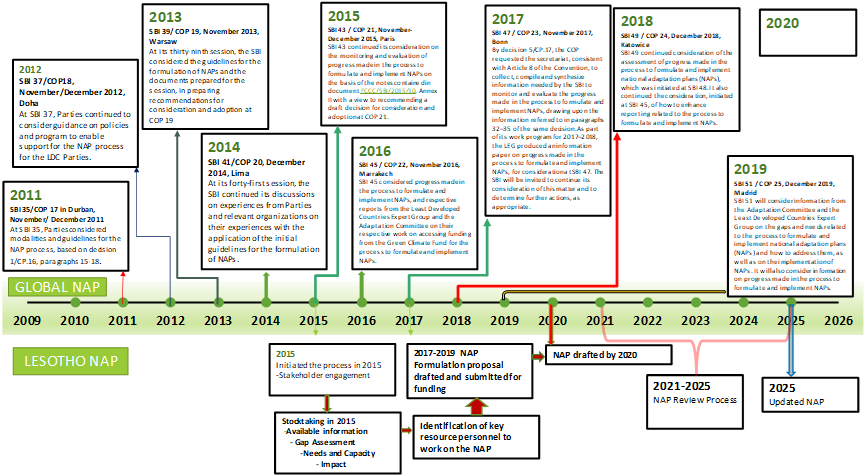

--- 
title: "Lesotho National Adaptation Plan"
author: "Lesotho NAP Team"
date: "`r Sys.Date()`"
site: bookdown::bookdown_site
documentclass: book
bibliography: [book.bib, packages.bib]
biblio-style: apalike
link-citations: yes
description: "Lesotho National Adaptation Plan"
---

# Preliminaries {-}
## The process to formulate the NAP {-}


## ABOUT LESOTHO   {-}
Geographically, Lesotho is located in the south eastern part of Southern Africa; at approximately 28°S and 31°S Latitude and 27°E and 30°E Longitude (LMS 2017). It occupies a land area of 30,355 km2, a north-south extent of about 230 km and a maximum width of about 210 km, with elevation ranging from 1,388 m to 3,482 m. Lesotho is a landlocked country surrounded by the Republic of South Africa (LMS 2017). Lesotho has a continental temperate climate characterized by four distinct seasons: spring, summer, autumn and winter (LMS 2017); its temperate climate with sub-alpine characteristics distinguishes it from other southern African countries (NAP Stocktaking Report 2015). The average temperature ranges between -10°C in winter and 30°C in summer (LMS 2017). The country receives most of its highly-variable rainfall between the months of October to April, with an average of 700 mm per annum (LMS 2017): the lowest average annual rainfall occurs in the Senqu River Valley (450 mm) and the highest in the north-eastern mountain zone (1,200mm) (LMS 2017). 


Lesotho is generally characterized by unemployment, poverty, food insecurity, lack of infrastructure, as well as high population pressure on arable land and natural resources (LMS 2017). Climate change is already affecting Lesotho’s climatic patterns with resultant substantial environmental and socio-economic loss, particularly because of its mountainous topography and socio-economic conditions (LMS 2017). Challenges related to climate change include (LMS 2017): spatial and temporal variability of rainfall; increased frequency and magnitude of floods and droughts; intense rainfall associated with flash floods, soil erosion and high sediment loads in rivers; strong winds associated with destruction of infrastructure such as houses and power lines; pasture degradation and desertification; shrinkage of habitats, and decrease in the number of plant species and wildlife; snowfall, which occurs annually over the mountains and on average once every three years in the lowlands, associated with extremely low temperatures, loss of livestock, hampered movement and access to essential services.


```{r include=FALSE}
# automatically create a bib database for R packages
knitr::write_bib(c(
  .packages(), 'bookdown', 'knitr', 'rmarkdown'
), 'packages.bib')
```
